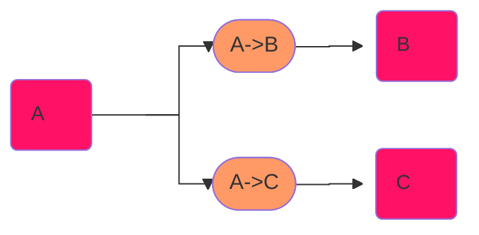

# Sample Flowcharts with  `mermaid`

```mermaid
%%{ init: {'flowchart': { 'curve': 'stepAfter' } } }%%

flowchart LR
    O[ ]:::empty
    A(A):::c1
    B(B):::c1
    C(C):::c1
    AB([A->B]):::c2
    AC([A->C]):::c2

    classDef c1 width:60px,fill:#f16,font-size:15px  
    classDef c2 fill:#f96    
    classDef empty width:0px,height:0px
    
    A --- O
    O --> AB 
    O --> AC
    AB --> B
    AC --> C
```
