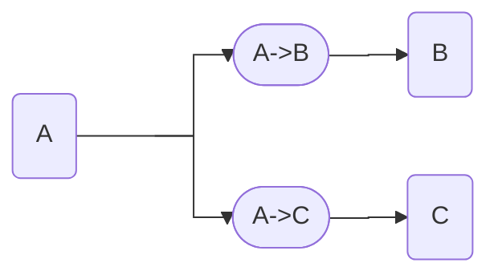
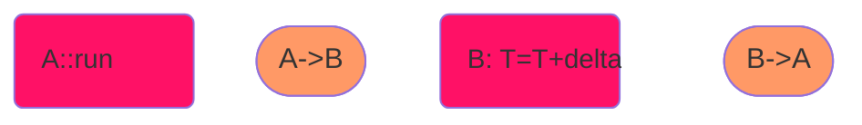
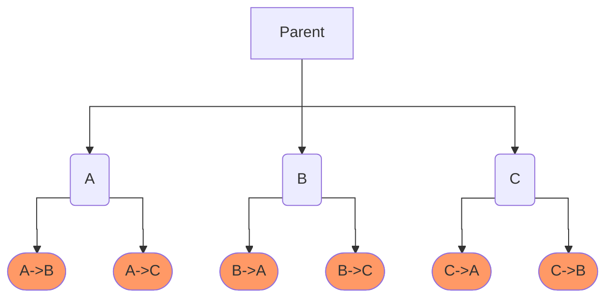
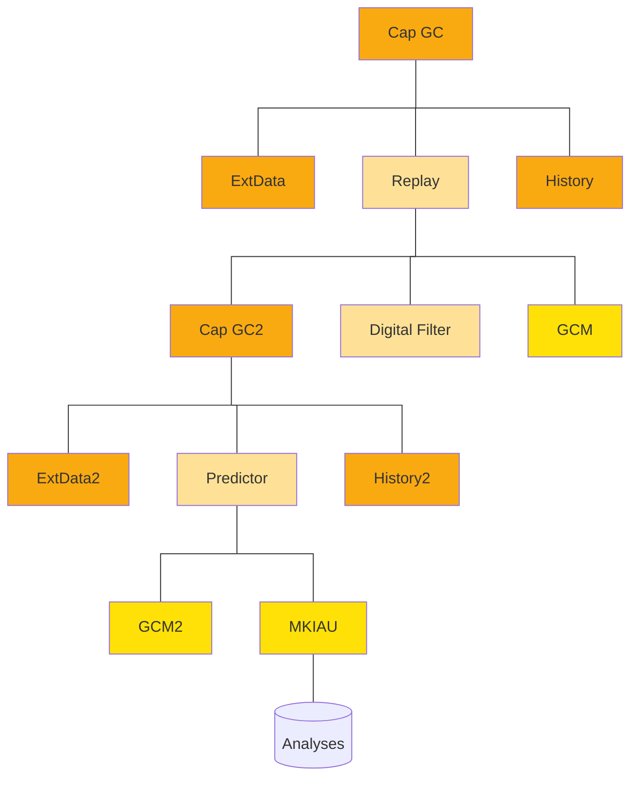

# Sample Flowcharts with  `mermaid`

#### Example

```mermaid
%%{ init: {'flowchart': { 'curve': 'stepAfter' } } }%%

flowchart LR
    O[ ]:::empty
    A(A):::c1
    B(B):::c1
    C(C):::c1
    AB([A->B]):::c2
    AC([A->C]):::c2

    %% classDef c1 width:60px,fill:#f16,font-size:15px  
    %% classDef c2 fill:#f96    
    classDef empty width:0px,height:0px,fill:#bbf
    
    A --- O
    O --> AB 
    O --> AC
    AB --> B
    AC --> C
```

#### Example

```mermaid
flowchart LR
    A("A::run"):::c1
    B("B: T=T+delta"):::c1
    AB([A->B]):::c2
    BA([B->A]):::c2
    
    classDef c1 width:100px,fill:#f16,font-size:15px 
    classDef c2 fill:#f96

    A ~~~ AB
    AB ~~~ B
    B ~~~ BA
```

#### Example

```mermaid
%%{ init: {'flowchart': { 'curve': 'stepAfter' } } }%%

flowchart TB
    %% This is a test
    P[Parent]:::c1
    O[ ]:::empty
    A(A):::c1
    B(B):::c1
    C(C):::c1
    AB([A->B]):::c2
    AC(["A->C"]):::c2
    BA(["B->A"]):::c2
    BC(["B->C"]):::c2
    CA(["C->A"]):::c2 
    CB(["C->B"]):::c2
    
    %% classDef c1 width:60px,fill:#f16,font-size:15px,font-weight:bold
    classDef c2 fill:#f96
    classDef empty width:0px,height:0px

    P --- O
    O --> A
    O --> B 
    O --> C
    A --> AB
    A --> AC
    B --> BA
    B --> BC
    C --> CA
    C --> CB
```

#### Example

```mermaid
%%{ init: {'flowchart': { 'curve': 'stepAfter' } } }%%

flowchart TB
    %% This is a test

    CA1[Cap GC]:::c1 --- CO1[ ]:::empty
    CO1 --- EX1[ExtData]:::c1 & RE[Replay]:::c2 & HI1[History]:::c1
    RE --- CO2[ ]:::empty
    CO2 --- CA2[Cap GC2]:::c1 & DF[Digital Filter]:::c2 & GC1[GCM]:::c3
    CA2 --- CO3[ ]:::empty
    CO3 --- EX2[ExtData2]:::c1 & PR[Predictor]:::c2 & HI2[History2]:::c1
    PR --- CO4[ ]:::empty
    CO4 --- GC2[GCM2]:::c3 & MK[MKIAU]:::c3
    MK --- AN[(Analyses)]

    classDef c1 fill:#faaa11
    classDef c2 fill:#fee196
    classDef c3 fill:#ffe107
    classDef empty width:0px,height:0px
```

#### Example

<!--
@startuml firstDiagram
Alice -> Bob: Hello
Bob -> Alice: Hi!
@enduml
-->

